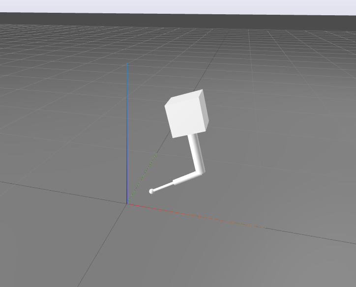

# Hopping Robot Trajectory Optimization

This project demonstrates nonlinear trajectory optimization over the full dynamics of a 2D hopping robot. The robot's two joints are a spring foot and a knee. The optimization is capable of finding long, agile leaps.

The dynamics are formulated as a hybrid system, alternating between a pinned and a free floating configuration. This handles contact very efficiently and is a natural choice for a robot with only one possible mode schedule. The only aspect of contact that must be pre-specified is the number of steps. The problem is transcribed with direct collocation and solved with SNOPT. This project uses the Drake robotics library for its tools in optimization, multibody dynamics, and visualization.



## Setup

Recommended to [install Drake over apt](https://drake.mit.edu/apt.html). Tested on Drake v1.15.0.

To build:
```bash
mkdir build
cd build
cmake ..
make
```

Open the browser-based visualizer from a separate terminal (the Python path may need tweaking):
```bash
env PYTHONPATH=${PYTHONPATH}:/opt/drake/lib/python3.10/site-packages python3 -m pydrake.visualization.meldis -w
```

Run the solver (from the build folder):
```bash
./main
```
Press enter once the result is printed to see the solution visualized at half speed. The problem configuration (initial and final states, number of steps, use of variable duration phases) may be modified in main.cpp. A 0.5m leap can be taken with two contact phases.

`main` also saves the solved trajectory. View it in slow motion with:
```bash
./replay
```